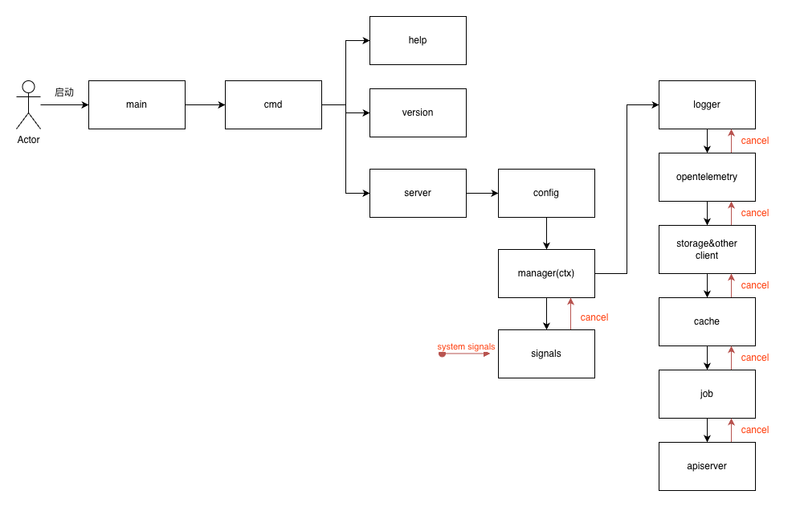
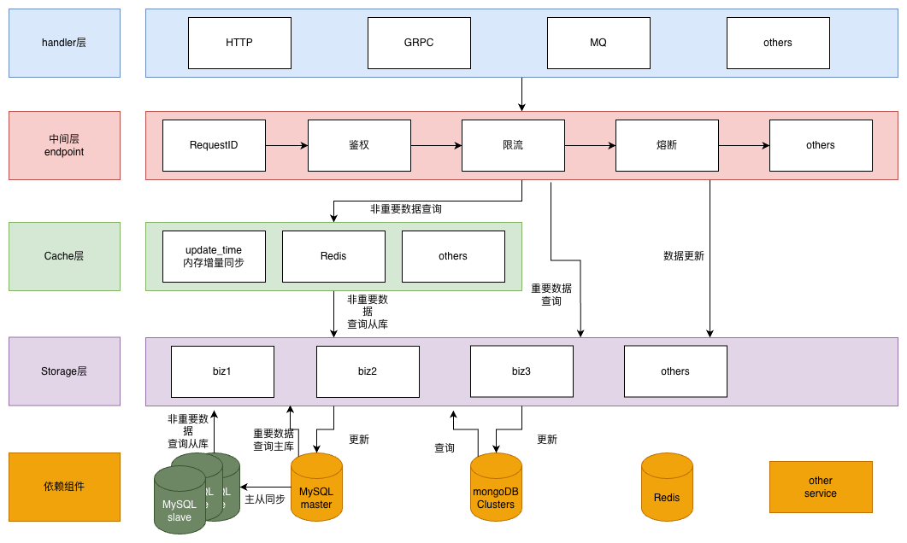

# go-layout
golang项目工程化
对于一个后端应用而言，它的启动和退出通常都是一些固定的动作

灵感来自 [controller-runtime](https://github.com/kubernetes-sigs/controller-runtime)

# 起停流程


# 项目架构


## 启动过程
### 1.启动环境准备
操作系统检查：确保依赖的系统资源、端口、文件权限等已就绪。

依赖检查：验证依赖的环境变量是否配置完整，如 JAVA_HOME、PYTHONPATH 或其他服务需要的依赖环境。

资源初始化：加载 SSL 证书、加密密钥、或其他必要的外部文件。

### 2.初始化配置

配置加载：支持多种配置源（配置文件、环境变量、远程配置中心）。

配置解析：根据运行环境（开发、测试、生产）加载不同的配置。

动态更新支持：如果需要支持热更新配置，启动相关监听器或 Watcher。

配置优先级：命令行参数 / 启动参数 > 环境变量 > 配置文件 > 默认值

### 3.初始化日志

日志库配置：设置日志格式（如 JSON 格式）、日志级别（DEBUG、INFO、ERROR）、日志分片规则（按天、按文件大小等）。

日志目标：支持多目标输出（控制台、文件、远程日志服务）。

日志上下文：设置全局上下文信息（如服务名、版本号、实例 ID）。

### 4.初始化各类客户端

数据库连接：初始化数据库连接池，进行连接检查（健康探测）。

缓存客户端：例如 Redis/Memcached 客户端的初始化和预热操作。

消息队列：启动 Kafka、RabbitMQ、或其他消息队列的生产者实例。

外部服务 API：初始化调用外部服务的客户端（如 HTTP、gRPC、GraphQL 等），并进行连通性测试。

### 5.初始化后台任务

任务调度器：启动任务调度器（如 Quartz、Cron 表达式任务）。

异步任务线程池：初始化线程池，确保资源分配合理（核心线程数、最大线程数、队列容量等）。

任务预加载：加载任务状态信息或预热相关依赖数据。

### 6.初始化各类 Server

Server 配置：加载服务端监听配置（IP 地址、端口号、协议类型）。

注册路由：注册 API 路由或服务方法（如 REST、gRPC、WebSocket）。

服务注册：向服务注册中心（如 Eureka、Consul、Nacos 等）注册服务信息。

### 7. 最终检查

依赖探活：确认所有依赖服务已启动正常。

健康探测：触发自测接口，确认服务完整功能正常。

日志记录：记录启动完成时间及版本信息。

## 停止过程

### 1. 捕获退出信号

支持多种信号（如 Unix 的 SIGTERM、SIGINT），并绑定信号处理器。

增加优雅退出的时间限制，避免长时间阻塞导致外部系统误判为服务僵死。

### 2. 停止各类 Server

停止接受新请求：优雅地关闭监听端口，拒绝新的连接。

处理未完成请求：等待当前请求完成，设置超时时间，超时后强制关闭。

注销服务：从注册中心注销服务实例，避免流量转发到已停止的实例。

### 3. 停止后台任务

任务终止：向所有正在运行的任务发送停止信号，优雅结束当前循环。

强制终止：对于超时未结束的任务，采用中断机制。

状态持久化：确保任务的状态和结果正确持久化，便于下次恢复。

### 4. 关闭各类客户端

数据库连接池：关闭连接池，确保连接归还资源池，并断开与数据库的连接。

缓存客户端：断开与 Redis 或其他缓存服务的连接，确保没有遗留的事务。

消息队列客户端：关闭生产者实例，确保消息不会丢失。

外部 API 客户端：关闭与外部服务的长连接或 WebSocket。

### 5. 关闭日志

刷新缓冲区：将日志缓冲区中的内容全部写入目标位置。

关闭资源：释放文件句柄、网络连接，避免日志服务资源泄露。

### 6. 清理配置和资源

内存清理：释放全局变量、线程本地变量等可能的内存占用。

文件清理：删除临时文件或其他启动过程中创建的中间文件。

服务锁清理：清理分布式锁或本地锁，防止下次启动时的冲突。

### 7. 记录退出信息

日志记录：记录退出时间、运行时长、错误信息（如果有）。

告警通知：如果服务非正常退出，向运维人员或告警系统发送通知。

# 注意事项
## automaxprocs
go 1.25 + 不再需要使用
```go
// go 1.25 以下的版本需要引入automaxprocs
import _ "go.uber.org/automaxprocs"
```