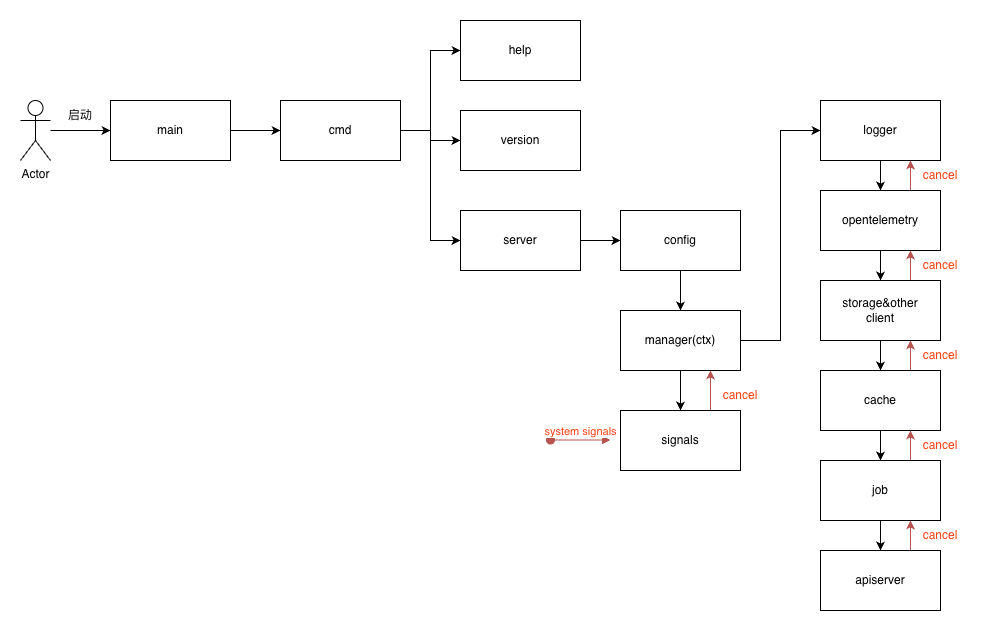
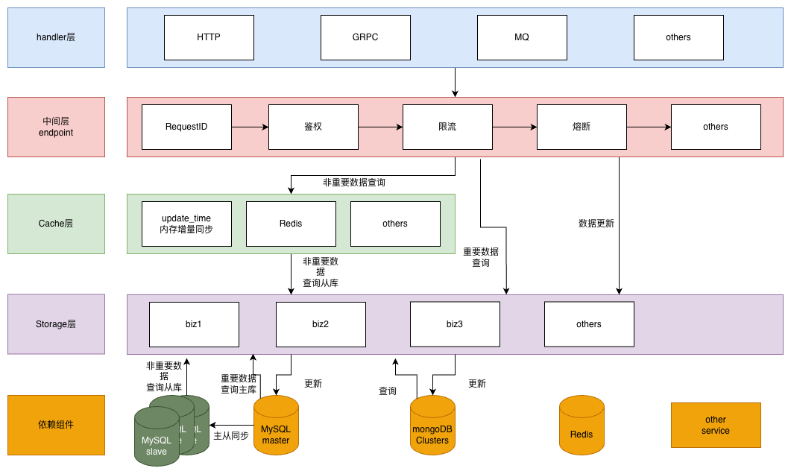

# 又一份 Go 项目布局指南？敬谢不敏。

随着 Go 语言日益普及，开发者们正将其他语言（特别是 Java 和 Spring Boot）中的结构化包袱带入其中，并冠以“最佳实践”之名。

如果你搜索“Go project layout”（Go 项目布局），难免会看到像臭名昭著的 `golang-standards/project-layout` 这样的仓库。这些模板推崇深层嵌套的目录结构、随意的架构分层（如 `service/`、`repository/`、`pkg/`）、臃肿的 Worker 池以及复杂的 Mock 框架。

**这些并非 Go 语言的惯用模式，而是用 Go 语法写就的 Java 模式。** 它们与 Go 的设计理念背道而驰。Go 语言的设计初衷是追求简洁、可读性以及扁平且易于探索的 API。当你强行将 Spring Boot 风格的分层架构套用到 Go 上时，往往会引入循环依赖，导致控制流变得晦涩难懂，并破坏这门语言最迷人的特质——极致的简洁。

扁平化结构推荐
```
// 惯用做法：拥有独立领域包的服务
myservice/
├── main.go        # 负责组装各组件；不包含业务逻辑
├── config/        # 配置结构体、环境变量加载
├── auth/          # 身份验证、会话中间件
├── db/            # 数据存储客户端及所有查询操作
├── storage/       # 对象存储（S3、R2、GCS）
├── billing/       # 支付服务商对接、账务记录
├── jobs/          # 任务生命周期、队列调度、Worker 处理逻辑（同一领域，归于一包）
├── web/           # HTTP 处理函数、HTML 模板、静态资源（设计上紧密耦合）
├── transcribe/    # 领域特定的处理逻辑——独立的纯函数
├── Makefile
├── Dockerfile
└── .env.example
```

power by [spf13](https://github.com/spf13)

# go-layout
golang项目工程化
对于一个后端应用而言，它的启动和退出通常都是一些固定的动作

灵感来自 [controller-runtime](https://github.com/kubernetes-sigs/controller-runtime)

- 上下文 (Context) ： `context.Context` 是否贯穿了所有 I/O、HTTP 或长时间运行的调用，是否指定了超时时间
- 并发 (Concurrency) ： Goroutine 是否具有明确的所有权和明确的关闭路径，在输入规模不确定的“扇出”（fan-out）场景中，是否限制了并发度，避免数据竞争
- 包设计 (Package design) ： 每个包是否具有单一且明确的领域职责？新增包是否有充分理由（而非仅仅扩展现有包），避免使用 `utils/` 或 `common/` 这类包名

# 起停流程


# 项目架构


# 一个简单的main函数
```go
package main

import "github.com/stonebirdjx/go-layout/cmd"

func main() {
	cmd.Execute()
}
```
> go 1.25以下需要 import _ "go.uber.org/automaxprocs"

## 启动过程
### 1.启动环境准备
操作系统检查：确保依赖的系统资源、端口、文件权限等已就绪。

依赖检查：验证依赖的环境变量是否配置完整，如 JAVA_HOME、PYTHONPATH 或其他服务需要的依赖环境。

资源初始化：加载 SSL 证书、加密密钥、或其他必要的外部文件。

### 2.初始化配置

配置加载：支持多种配置源（配置文件、环境变量、远程配置中心）。

配置解析：根据运行环境（开发、测试、生产）加载不同的配置。

动态更新支持：如果需要支持热更新配置，启动相关监听器或 Watcher。

配置优先级：命令行参数 / 启动参数 > 环境变量 > 配置文件 > 默认值

### 3.初始化日志

日志库配置：设置日志格式（如 JSON 格式）、日志级别（DEBUG、INFO、ERROR）、日志分片规则（按天、按文件大小等）。

日志目标：支持多目标输出（控制台、文件、远程日志服务）。

日志上下文：设置全局上下文信息（如服务名、版本号、实例 ID）。

### 4.初始化各类客户端

数据库连接：初始化数据库连接池，进行连接检查（健康探测）。

缓存客户端：例如 Redis/Memcached 客户端的初始化和预热操作。

消息队列：启动 Kafka、RabbitMQ、或其他消息队列的生产者实例。

外部服务 API：初始化调用外部服务的客户端（如 HTTP、gRPC、GraphQL 等），并进行连通性测试。

### 5.初始化后台任务

任务调度器：启动任务调度器（如 Quartz、Cron 表达式任务）。

异步任务线程池：初始化线程池，确保资源分配合理（核心线程数、最大线程数、队列容量等）。

任务预加载：加载任务状态信息或预热相关依赖数据。

### 6.初始化各类 Server

Server 配置：加载服务端监听配置（IP 地址、端口号、协议类型）。

注册路由：注册 API 路由或服务方法（如 REST、gRPC、WebSocket）。

服务注册：向服务注册中心（如 Eureka、Consul、Nacos 等）注册服务信息。

### 7. 最终检查

依赖探活：确认所有依赖服务已启动正常。

健康探测：触发自测接口，确认服务完整功能正常。

日志记录：记录启动完成时间及版本信息。

## 停止过程

### 1. 捕获退出信号

支持多种信号（如 Unix 的 SIGTERM、SIGINT），并绑定信号处理器。

增加优雅退出的时间限制，避免长时间阻塞导致外部系统误判为服务僵死。

### 2. 停止各类 Server

停止接受新请求：优雅地关闭监听端口，拒绝新的连接。

处理未完成请求：等待当前请求完成，设置超时时间，超时后强制关闭。

注销服务：从注册中心注销服务实例，避免流量转发到已停止的实例。

### 3. 停止后台任务

任务终止：向所有正在运行的任务发送停止信号，优雅结束当前循环。

强制终止：对于超时未结束的任务，采用中断机制。

状态持久化：确保任务的状态和结果正确持久化，便于下次恢复。

### 4. 关闭各类客户端

数据库连接池：关闭连接池，确保连接归还资源池，并断开与数据库的连接。

缓存客户端：断开与 Redis 或其他缓存服务的连接，确保没有遗留的事务。

消息队列客户端：关闭生产者实例，确保消息不会丢失。

外部 API 客户端：关闭与外部服务的长连接或 WebSocket。

### 5. 关闭日志

刷新缓冲区：将日志缓冲区中的内容全部写入目标位置。

关闭资源：释放文件句柄、网络连接，避免日志服务资源泄露。

### 6. 清理配置和资源

内存清理：释放全局变量、线程本地变量等可能的内存占用。

文件清理：删除临时文件或其他启动过程中创建的中间文件。

服务锁清理：清理分布式锁或本地锁，防止下次启动时的冲突。

### 7. 记录退出信息

日志记录：记录退出时间、运行时长、错误信息（如果有）。

告警通知：如果服务非正常退出，向运维人员或告警系统发送通知。

